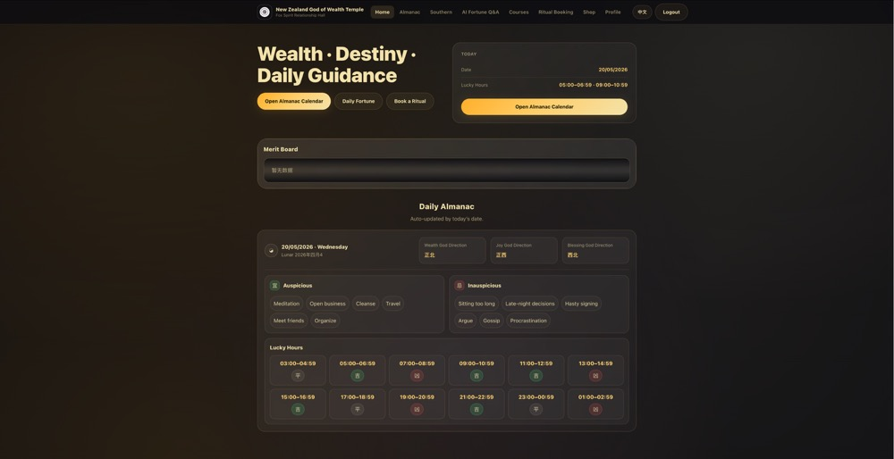
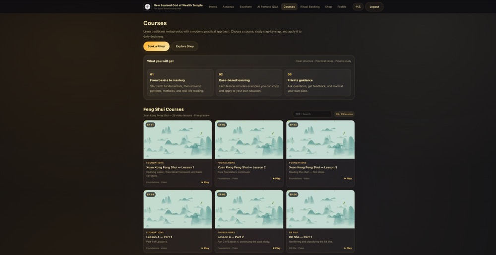

# NZ Temple - Chinese Almanac & Temple Services Platform

A full-stack web application for a New Zealand-based Chinese temple, featuring an interactive Chinese almanac (黄历) system, AI-powered fortune-telling Q&A, religious service bookings, and user profile management.

## Live Demo

🔗 **[https://nz-temple.vercel.app](https://nz-temple.vercel.app)**

---

## Screenshots

### Homepage with Merit Board


### AI Fortune Q&A System


### Course Dashboard


---

## Overview

This project serves the Chinese community in New Zealand by providing:

- **Personalized Chinese Almanac** - Daily fortune calendar with Southern Hemisphere astronomical corrections
- **AI Fortune Advisor** - Rule-based Q&A system providing guidance based on traditional Chinese almanac principles
- **Service Booking System** - Online booking for religious ceremonies and offerings
- **Merit Board** - Public display of temple contributions with privacy protection
- **User Profiles** - Personal BaZi (八字) calculation and storage for customized fortune readings

The application addresses the unique needs of Southern Hemisphere users by providing geographically-corrected directional guidance (财神方位) and localized calendar calculations.

---

## Tech Stack

**Frontend**
- HTML5, CSS3, JavaScript (Vanilla JS)
- Responsive design with mobile-first approach
- Canvas API for almanac image generation
- LocalStorage for client-side caching

**Backend**
- Vercel Serverless Functions (Python)
- Flask (local development only)
- RESTful API architecture

**Database & Authentication**
- Supabase (PostgreSQL)
- Supabase Auth for user management
- Row-level security policies

**External Services**
- AWS S3 for media storage
- Formspree for email notifications

**Python Libraries**
- `lunar-python` - Chinese lunar calendar calculations

**Deployment**
- Vercel (frontend + serverless functions)
- Automatic deployments from main branch

---

## Key Features

### Chinese Almanac System
- Four display modes with Southern Hemisphere astronomical corrections
- 12 time periods (时辰) with fortune ratings and activity recommendations
- PNG export for downloadable almanac images

### BaZi (八字) Integration
- Three input methods: birthdate calculation, manual input, or profile retrieval
- Personal fortune overlay on daily almanac
- Persistent storage in user profiles

### AI Fortune Q&A
- Rule-based answer generation using daily almanac data
- Fully client-side logic with no external API dependencies

### Service Booking
- Ritual ceremony bookings with tiered pricing
- Email confirmation via Formspree integration

### User System
- Registration and authentication via Supabase Auth
- Profile management with BaZi storage
- Role-based access control (admin dashboard)

### Merit Board
- Public contribution display with name masking
- Bilingual support (Chinese/English)

---

## Architecture

### Frontend Structure
- Static HTML pages with shared navigation
- Bilingual UI (Chinese/English) via `localStorage`
- Shared authentication state in `supabase.js`

### API Endpoints

8 Python serverless functions handle almanac calculations, BaZi analysis, and personalized fortune readings. Key endpoints include daily almanac data, personal fortune overlays, and AI Q&A generation.

### Database Schema

PostgreSQL database with row-level security policies. Core tables: user profiles, bookings, inventory, merit board, and site settings.

---

## Project Structure

```
├── api/                    # Vercel serverless functions
│   ├── _almanac.py        # Shared almanac calculation logic
│   ├── day.py             # Basic almanac endpoint
│   ├── bazi.py            # BaZi calculation endpoint
│   └── ...
├── calendar_modules/       # Calendar generation utilities
├── docs/                   # Internal documentation
├── images/                 # Application assets
├── screenshots/            # README documentation images
├── index.html              # Homepage with merit board
├── calendar.html           # Almanac system
├── booking.html            # Service booking interface
├── wealth-ai.html          # AI Q&A system
├── login.html              # Authentication
├── profile.html            # User profile management
├── admin.html              # Admin dashboard
├── shop.html               # E-commerce page
├── courses.html            # Course information
├── fortune.html            # Fortune-telling page
├── southern.html           # Southern Hemisphere explanation
├── style.css               # Global styles
├── supabase.js             # Supabase client configuration
├── app.py                  # Local development server (Flask)
├── requirements.txt        # Python dependencies
└── vercel.json             # Vercel deployment configuration
```

---

## Installation and Setup

### Prerequisites
- Python 3.8+
- Supabase account
- AWS S3 bucket (for video content)

### Local Development

1. **Clone the repository**
   ```bash
   git clone https://github.com/zj115/nz-temple-vercel-static.git
   cd nz-temple-vercel-static
   ```

2. **Install Python dependencies**
   ```bash
   pip install -r requirements.txt
   ```

3. **Configure environment variables**
   ```bash
   cp .env.example .env
   # Edit .env with your AWS credentials
   ```

4. **Run local development server**
   ```bash
   python app.py
   # Server runs on http://127.0.0.1:5001
   ```

### Deployment to Vercel

```bash
vercel --prod
```

The `app.py` Flask server is only for local development and does not affect Vercel deployment.

---

## Environment Variables

Create a `.env` file in the root directory:

```env
# AWS S3 credentials (for video content)
AWS_ACCESS_KEY_ID=your_aws_access_key
AWS_SECRET_ACCESS_KEY=your_aws_secret_key
AWS_REGION=ap-southeast-2
```

**Note:** Supabase public credentials are configured in `supabase.js` and are safe for client-side use.

---

## My Contribution

I developed this full-stack application from scratch, handling:

- **Frontend Development** - Built all HTML/CSS/JS pages with responsive design and bilingual support
- **Backend API Design** - Implemented 8 Python serverless functions for almanac calculations and data processing
- **Database Architecture** - Designed PostgreSQL schema with Supabase integration and row-level security
- **Chinese Almanac Logic** - Integrated `lunar-python` library and implemented Southern Hemisphere astronomical corrections
- **Authentication System** - Configured Supabase Auth with role-based access control
- **Canvas Rendering** - Built almanac image generation system for PNG exports
- **Deployment** - Configured Vercel deployment with serverless function routing

---

## Security and Privacy

- All sensitive credentials are stored in environment variables and excluded from version control
- Supabase Row Level Security (RLS) policies protect user data
- Public API keys in `supabase.js` are anon keys with restricted permissions
- User names on merit board are automatically masked for privacy
- No production secrets or customer data are included in this repository

---

## Future Improvements

- Add automated testing for almanac calculation accuracy
- Implement payment gateway integration for online donations
- Add real-time notifications for booking confirmations
- Expand AI Q&A system with more question categories
- Create mobile app version using React Native
- Add calendar event export (iCal format)

---

## Notes

This repository is shared for portfolio and demonstration purposes. Some business-specific details have been generalized to protect client privacy. The application is deployed and actively used by a New Zealand-based organization.

---

## License

This repository is shared for portfolio and demonstration purposes only.
